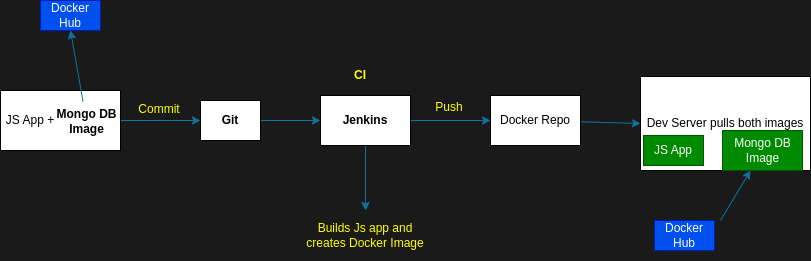

### Container

-   A way to package application with all the necessary dependencies and configuration.
-   Portable artifact, easily shared and moved around
-   Makes development and deployment more efficient

**Containers live in _Container Repository_.**
**Container repos could be private or public**

_DockerHub is an example of public repo_

### How Container improved Application Devlepoment

-   For 10 different types of OS, we needed to install the dependencies with different steps and commands. This is more error prone.
-   With Containers
    -   It is an own isolated environment with all needed configuration packaged.
    -   We use one command to install the app.
    -   We can also run different versions of the same application.

### How Container improved Application Deployment

-   Without Containers
    -   Configuration on the server needed. So, dependency version conflicts might occur.
    -   The Developers provide textual guide of deployment to the Operations team. So, misunderstandings can occur
-   With Containers
    -   Developers and Operations work together to package the application in a container
    -   No enviromental configurations needed on the server except Docker Runtime

### Docker (Technically)

-   Layers of images.
-   Mostly Linux (alpine) based image, because small in size.
-   Application image on top.
-   When downloading an app, only the image(s) with different versions will download

### Image vs Container

-   **Image**
    -   The actual package, with all the configs, etc
    -   Artifact that can be moved around
-   **Container**
    -   When the app is run, the container environment is created
    -   Also has virtual file system

### Docker vs VM

_Docker and VM are both virtualization tools.But they virtualize different parts of the OS_

-   OS level difference
    -   Docker virtualizes the Applications layer only
    -   VM virtualizes the Application and Kernel layers
    -   Docker size is small(MB) while VM size is large(GB)
    -   Docker containers start and run fast
    -   VM of any OS can run on any other OS host but docker can't do that (Not true for latest windows versions)

### Workflow for docker



### Commands

-   Downloading app
    -   `docker pull <app_name>`
    -   `docker pull <app_name>:version`
-   Running app
    -   `docker run <app_name>`
    -   `docker run <app_name>:version`
    -   If image not found locally, it will download from dockerhub
-   See all the running containers
    -   `docker ps`
-   Running container in detached mode
    -   `docker run -d <app_name>`
-   Restart container
    -   `docker stop <CONTAINER_ID>`
    -   `docker start <CONTAINER_ID>`
-   Show all containers (Running and Stopped)
    -   `docker ps -a`
-   Running container with a name
    -   `docker run --name <container_name> <app_name>`
-   Binding container and host ports
    -   `docker run -p<HOST_PORT>:<CONTAINER_PORT> <app_name>`
-   Deleting a container
    -   `docker rm <CONTAINER_ID>`

**Debugging Commands**

-   Show logs
    -   `docker logs <CONTAINER_ID>`
    -   `docker logs <container_name>`
-   Get the terminal of running container
    -   `docker exec -it <CONTAINER_ID> /bin/bash`
    -   Exit the terminal using `exit`

**Network Commands**

-   Show networks
    -   `docker network ls`
-   Create network
    -   `docker network create <network_name>`
-   Running with network
    -   `docker run --net <network_name>`

### Automating running docker containers

**Using docker compose**

-   Starting container(s)
    -   `docker-compose -f test.yaml up`
-   Stopping container(s)
    -   `docker-compose -f test.yaml down`

```yml
version: "3"
services:
    mongodb:
        image: mongo
        ports:
            - 27017:27017
        environment:
            - MONGO_INITDB_ROOT_USERNAME=admin
            - MONGO_INITDB_ROOT_PASSWORD=password
    mongo-express:
        image: mongo-express
        ports:
            - 8080:8080
        environment:
            - MONGO_ROOT_USERNAME=admin
            - MONGO_ROOT_PASSWORD=password
```

_Docker compose takes care of creating a common network_

### Docker volumes

_For data consistency bewteen container restarts_

-   A directory in physical host file system is mounted into the virtual file system of Docker
-   Defined inside the `docker-compose.yaml` file

-   Host volume
    -   You decide where on the host file system the reference is made
    -   `docker run -v <host_directory>:<container_directory>`
-   Anonymous volumes
    -   For each container a folder is generated that gets mounted.
        -   var/lib/docker/volumes/random-hash/\_data
    -   `docker run -v <container_directory>`
-   Named volumes
    -   You can reference the volume by $name$
    -   `docker run -v <name>:<container_directory>`
    -   Used in production

### Building docker image

-   Dockerfile (The file should have this name wothout extension)
    -   Blueprint for building docker images
-   Building image
    -   `docker build -t <app_name>:<tag> <host_directory>`
-   Show all available images
    -   `docker images`
-   Deleting an image
    -   `docker rmi <IMAGE_ID>`

```
FROM node:8-buster
ENV MONGO_USER=admin
RUN mkdir -p /home/app
COPY . /home/app
CMD ["node", "/home/app/server.js"]
```

-   The image will have node contained bcoz of FROM
-   Any additional environment variables added using ENV (optional)
-   Linux command can be run inside image using RUN
-   COPY is a host command
-   CMD is a entry command
